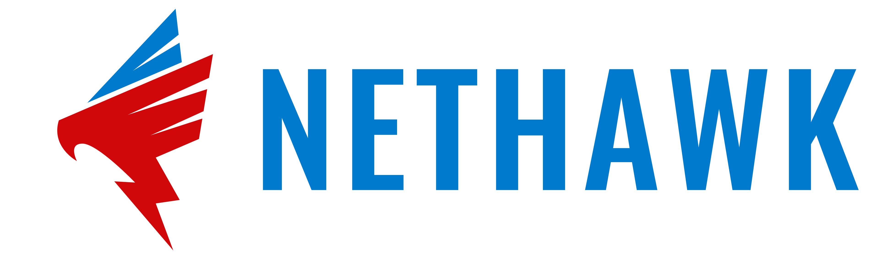

NetHAWK is a simple, powerful network monitoring tool that helps you see what's happening on your network in real-time. With an easy-to-use graphical interface, it's perfect for both beginners and experienced users.

## Features

- **Real-time Monitoring**: Watch network traffic as it happens.
- **Protocol Support**: Tracks both TCP and UDP connections.
- **IP Geolocation**: Shows where IP addresses are located.
- **Custom Filters**: Filter traffic by port numbers or ignore private IPs.
- **Detailed Information**: Displays IP addresses, ports, locations, and packet counts.
- **User-friendly Interface**: Easy to use, even if you're not a network expert.

2. Select a network interface from the dropdown menu.

3. Choose TCP or UDP protocol.

4. (Optional) Enter port numbers to filter.

5. Click "Start Monitoring" to begin.

## How to Use

1. **Select Network Interface**: Choose the network adapter you want to monitor.

2. **Choose Protocol**: Select either TCP or UDP.

3. **Set Port Filter**: (Optional) Enter specific port numbers to monitor, separated by commas.

4. **Filter Private IPs**: Check this box to ignore traffic from private IP addresses.

5. **Start/Stop Monitoring**: Click the button to begin or end monitoring.

6. **View Results**: The table will show live network traffic information.

7. **Copy Data**: Right-click on any row to copy the information.

## Troubleshooting

- If you don't see any network interfaces, try running the program as administrator.
- Make sure your firewall isn't blocking NetHAWK.
- Check the `nethawk.log` file in the program directory for any error messages.

## Contributing

We welcome contributions! Please see our [Contributing Guidelines](CONTRIBUTING.md) for more details.

## License

This project is licensed under the MIT License - see the [LICENSE](LICENSE) file for details.

## Acknowledgments

- Thanks to all the open-source libraries that made this project possible, especially to [IP-API](https://ip-api.com/).

## Support

If you encounter any issues or have questions, please file an issue on our [GitHub Issues page](https://github.com/ajdev05/NetHAWK/issues).

## Discussions

Join our community discussions! Share your experiences, ask questions, or suggest new features on our [Discussions page](https://github.com/ajdev05/NetHAWK/discussions).

---

Made using 🧠+🐍 by AJDEV05
